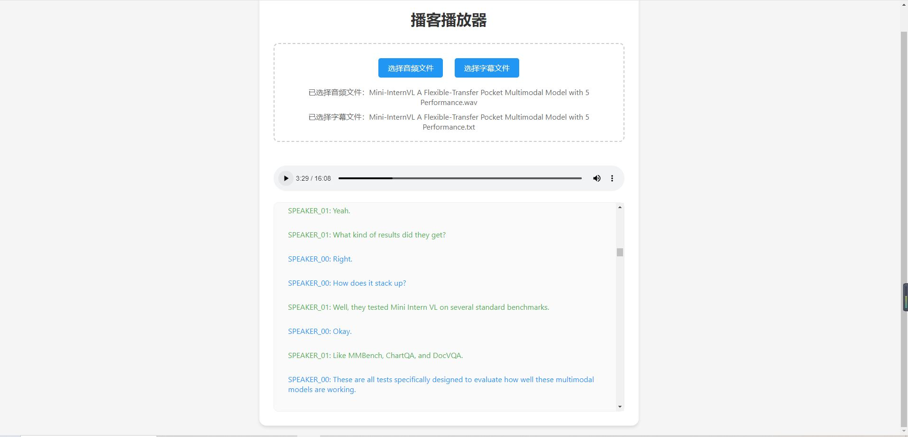

# 播客播放器

这个简单的网页应用可以播放音频文件并同步显示字幕。它支持 `.wav` 格式的音频和 `.txt` 格式的字幕文件。

## 功能

* **音频播放:**  支持播放 `.wav` 音频文件。
* **字幕同步:**  加载并同步显示 `.txt` 格式的字幕。字幕格式要求每三个一行，分别是说话人、时间戳（格式为 HH:MM:SS）、字幕内容。
* **高亮显示:**  当前播放的字幕会高亮显示。
* **自动滚动:**  字幕区域会自动滚动以保持当前字幕可见。
* **错误处理:**  能识别并标记格式错误的字幕行。

## 使用方法

1. **上传音频:** 点击 "选择音频文件" 按钮，选择 `.wav` 格式的音频文件。
2. **上传字幕:** 点击 "选择字幕文件" 按钮，选择 `.txt` 格式的字幕文件。字幕格式如下：

   ```
   Speaker_00
   00:00:05
   这是第一句字幕。

   Speaker_01
   00:00:10
   这是第二句字幕，由另一个说话人所说。

   ...
   ```

3. **播放音频:** 使用音频播放器控件控制播放。字幕会自动同步显示。

## 演示视频

[](demo.mp4)


## 代码说明

该项目使用 HTML、CSS 和 JavaScript 构建。

* **HTML:**  构建页面结构，包括音频播放器和字幕显示区域。
* **CSS:**  设置页面样式。
* **JavaScript:**  处理音频和字幕文件的上传、解析字幕、同步字幕和高亮显示。

关键 JavaScript 代码片段：

* **`parseSubtitles()` 函数:** 解析字幕文件内容，将其转换为 JavaScript 对象数组。
* **`displaySubtitles()` 函数:** 将解析后的字幕显示在页面上。
* **`audioPlayer.addEventListener('timeupdate', ...)`:** 监听音频播放进度，同步高亮字幕。


## 未来改进

* 支持更多音频格式（例如 `.mp3`）。
* 支持更丰富的字幕格式（例如 SRT）。
*  更友好的用户界面，例如进度条控制、音量控制等。
*  更健壮的错误处理，例如对无效字幕文件的处理。


##  部署

该项目是一个静态网页应用，可以直接部署到任何支持 HTML、CSS 和 JavaScript 的服务器上。
